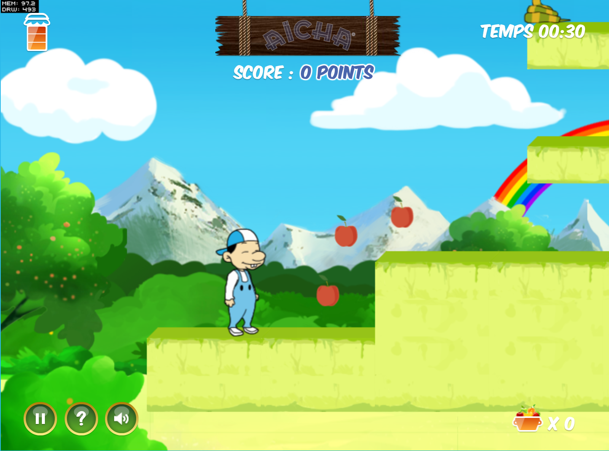
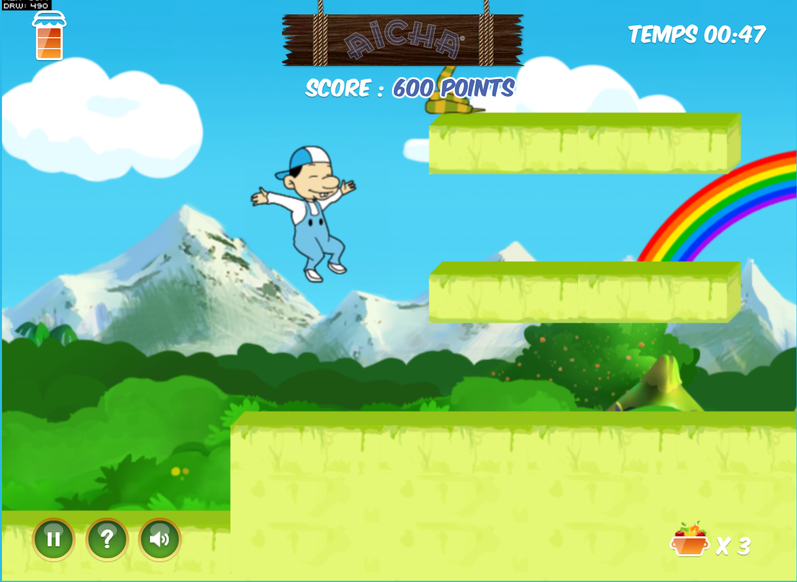
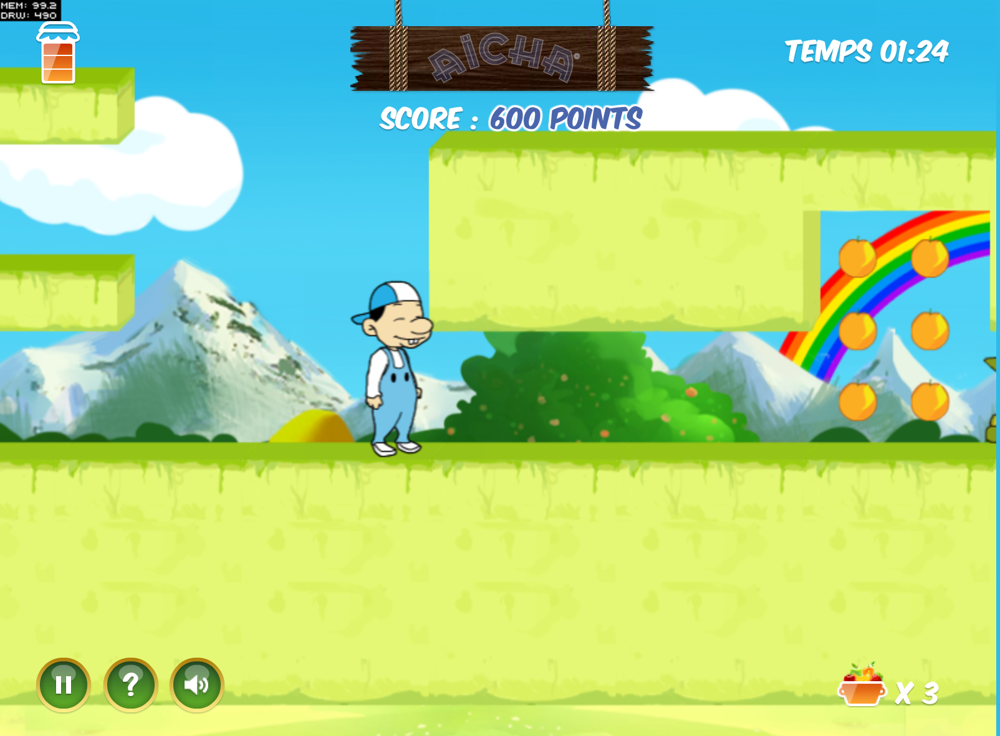
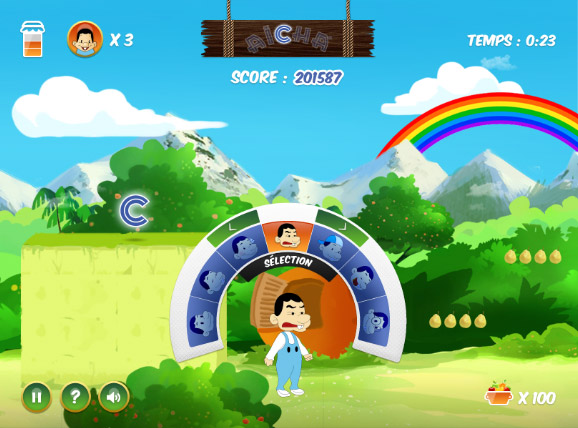
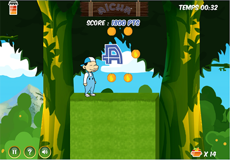

# AichaGame

<b>Aicha Game </b> is a 2D platformer game , with 4 world (Outdoor,Forest,Water,InDoor ) in each one there are 3 levels .

the player has to collect A I C H A letters , using 7 characters (9fizou, krichou , 7chimou , frihou ,fhimou ,ksilou , ngirou )

and switching between these characters as the gameplay needs , each one has a special power or skill like jumbing , ducking ,crawling , pushing ,shooting  ....

<b>Screenshots</b> :
 

<b>Technologies</b> :

The game developed using <b>CitrusEngine</b> which enables to use :

- <b>Box2d</b> : for the game physics which allowed us to implement a complex gameplay mechanisms  , one-way platform , moving platform , water bridge ..
- <b>Starling</b> / Stage3D : All Game graphic elements are rendered using Starling framework which gives better performance .
- <b>Signals</b> : using AS3 Signals rather then normal AS3 Event model .
- <b>Blitting</b> : we had a lot of animations due to the number of hero characters , and the enemies , so the blitting (generating spritesheets ) was the perfect solution to get the max in terms of performance

